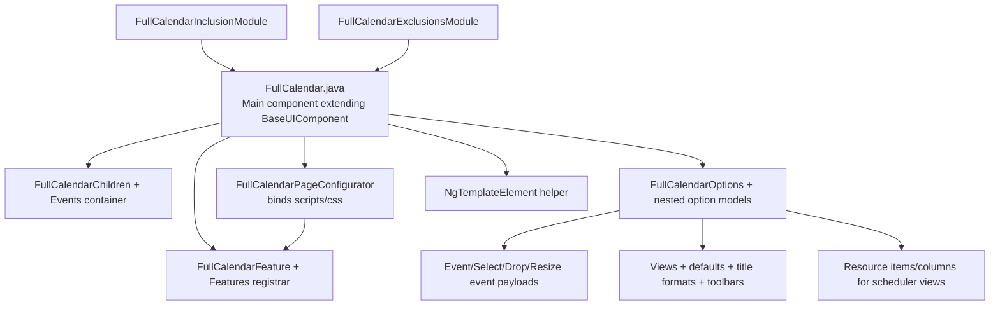

# C4 – Component (FullCalendar Plugin)

Evidence
- `src/main/java/com/jwebmp/plugins/fullcalendar/**` for components/options/events.
- `module-info.java` exports and service bindings; `META-INF/services/**` registers configurators.
- Tests under `src/test/java/...` exercise rendering, events, and examples.
