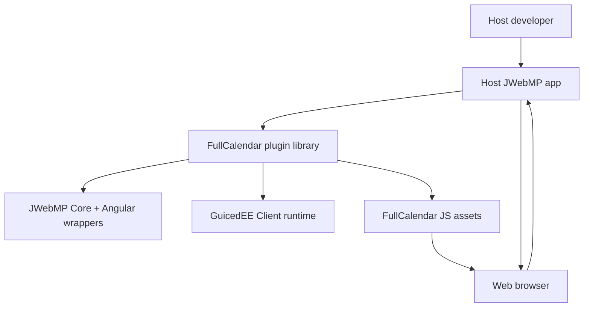

# C4 – Context

Notes
- Scope is a server-rendered JWebMP library consumed by host apps; browser executes the bundled FullCalendar JavaScript.
- External integrations (BrowserStack, CI, etc.) are documented separately; unknown runtime hosting details remain open.
