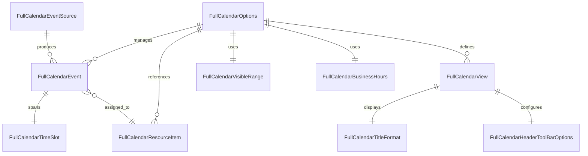

# ERD – Calendar Domain Objects

Interpretation
- Classes derived from option/event models under `src/main/java/com/jwebmp/plugins/fullcalendar/options/**`.
- Relationships are logical (in-memory configuration) rather than persisted database tables; adjust if host apps introduce persistence.
