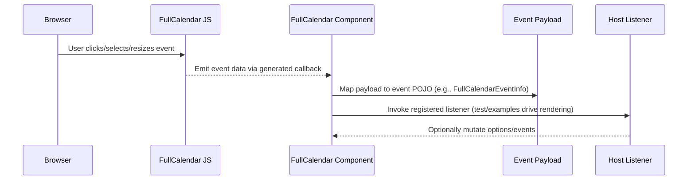

# Sequence – Receive Client Event

Notes: Event payload classes under `src/main/java/com/jwebmp/plugins/fullcalendar/events` and usage in tests guide the mapping; actual transport wiring is handled by JWebMP/Angular bridges.
